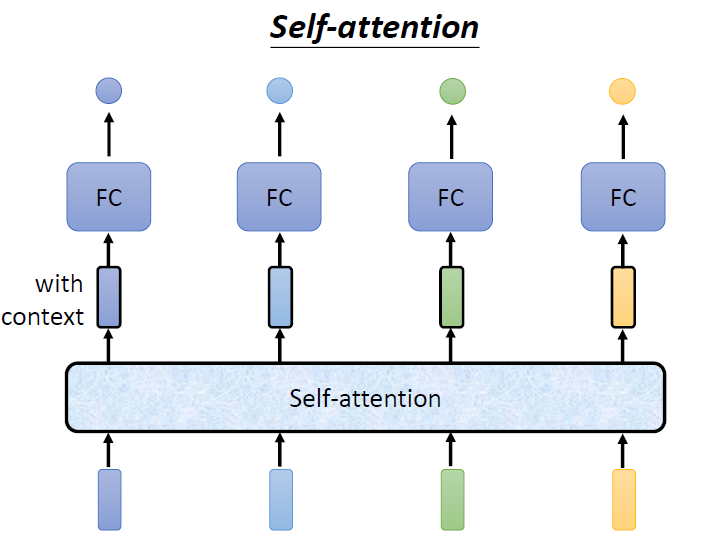
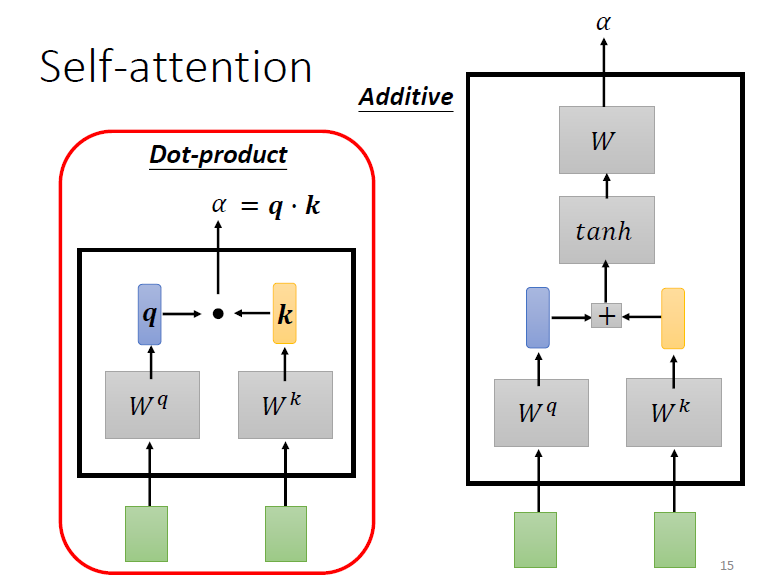
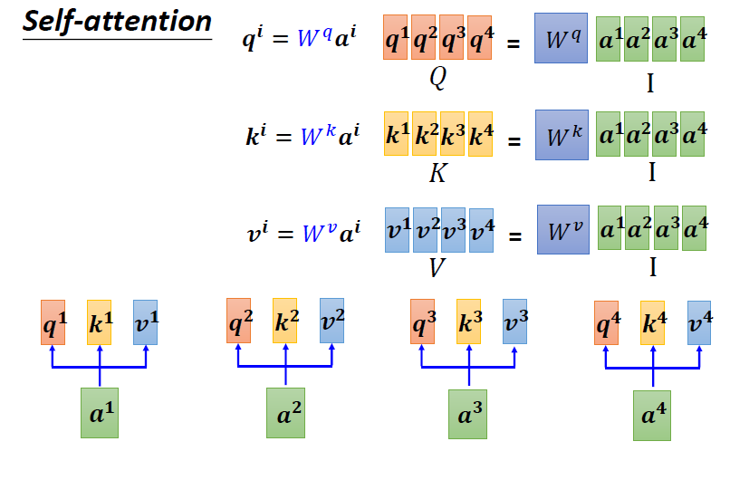
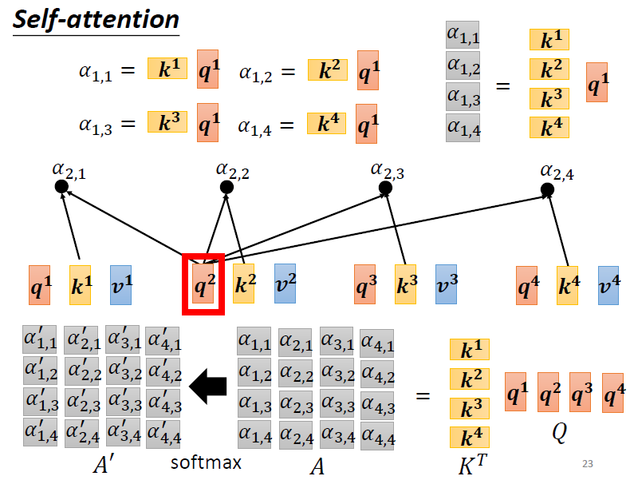
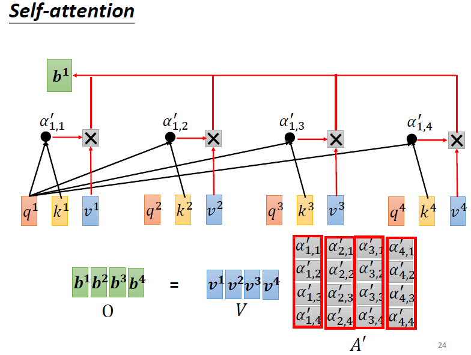

# TransFormer 模型详解
 
 本章节内容参考自台湾大学李宏毅教授的 [Self Attention](https://speech.ee.ntu.edu.tw/~hylee/ml/ml2021-course-data/self_v7.pdf) 。

 ## 问题引入

 传统 CNN 等模型处理的大多是`vector -> label/value (classification/regression)`的问题，而 NLP 任务中更多的是`sequence -> sequence`的问题，例如**机器翻译、文本生成、音频识别、社交网络、化学分子式等**任务。 传统 RNN/LSTM 等模型在处理长序列时会遇到梯度消失/爆炸的问题，且并行化能力较差。 Transformer 模型的提出正是为了解决这些问题。Transformer 通过自注意力机制（Self-Attention）能够更好地捕捉序列数据中的长距离依赖关系，并且具有更好的**并行化**能力。

 ## Vector Set Encoding

 ### One-Hot Encoding

 独热编码（One-Hot Encoding）是一种将离散变量转换为二进制向量的表示方法。在 NLP 中，词汇表中的每个单词都可以表示为一个独热向量，其中只有一个位置为1，其余位置为0。例如，假设词汇表中有5个单词：["I", "love", "transformers", "library", "!"]，那么单词 "love" 的独热编码表示为 [0, 1, 0, 0, 0]。

 但是这样会存在两个致命的问题：
 - 维度过高：对于大型词汇表，独热编码会导致非常高维的向量表示。
 - 语义信息缺失：独热编码无法捕捉单词之间的语义相似关系，单独 1 值无法判断两个单词的相似度。

 ### Word Embedding

词嵌入（Word Embedding）是一种将单词映射到低维连续向量空间的技术。通过训练神经网络模型，可以学习到每个单词的向量表示，使得语义相似的单词在向量空间中距离更近。常见的词嵌入方法包括 **Word2Vec**、GloVe 和 FastText。

## Sequence Labeling

### Fully Connected Noetwork

输入序列经过词嵌入后，对每个输入向量单独进行 Fully Connected Network 处理，输出每个 Vector 对应的标签。

存在问题：输入序列的上下文信息无法被利用，假设前提是输入序列的各个分词向量相互独立。

改进：设置 Windows Size，利用局部上下文作为输入。

问题：Sequence 长度过长且长度不一致，运算量大，且无法捕捉长距离依赖关系。

### Self-Attention

对于 Attention 的计算，有多种不同的方法，如 Drop-product Attention、Additive Attention 等。这里介绍一种常用的 Scaled Dot-Product Attention 计算方法。

对于给定的 $W^q、W^k、W^v$ `n×n 维矩阵`（在训练时需要更新的参数），输入序列：
$$I= \begin{bmatrix}
\\
\mathit{A_1} \quad \mathit{A_2} \quad \mathit{A_3} ...\\
\\
\end{bmatrix}$$
其中 $\mathit{A_i}$ 是输入序列的第 i 个词的词嵌入`列向量`。

对于每个输入向量 $\mathit{A_i}$，计算其 Query、Key、Value 向量：
$$
Q_i = W^q \cdot A_i,\quad
K_i = W^k \cdot A_i,\quad
V_i = W^v \cdot A_i
$$
得到的 Query、Key、Value 矩阵依然是 `n 维列向量`。

接下来，计算输入序列中每个词对其他词的注意力权重。对于输入序列中的每个词 $\mathit{A_i}$，计算其 Query 向量 $Q_i$ 与所有词的 Key 向量 $K_j$ 的点积，得到注意力分数，然后通过 Softmax 函数归一化，得到注意力权重，公式化如下：
$$
\text{Attention}(Q_i, K_j) = \text{softmax}(K_j^T \cdot Q_i / \sqrt{d_k})
$$
其中，$d_k$ 是词向量的维度，$\sqrt{d_k}$ 是缩放因子，防止点积值过大导致Softmax 函数梯度消失。

:::info
为什么要除以 $\sqrt{d_k}$？
- 数值稳定性：当 $Q_i$ 与 $K_j$ 的维度为 $d_k$ 时，点积 $Q_i^\top K_j$ 的量级会随维度增大而增大，导致 softmax 的 logits 过大、分布过尖锐，训练不稳定。
- 方差分析：若 $Q_i$、$K_j$ 的各分量独立同分布，均值 0、方差 1，则
$$
\operatorname{Var}(Q_i^\top K_j)=d_k\quad \Rightarrow\quad \operatorname{Var}\!\left(\frac{Q_i^\top K_j}{\sqrt{d_k}}\right)\approx 1
$$
缩放后 logits 处于合理尺度，有利于梯度传播与收敛。

与 softmax 的区别：

- $\sqrt{d_k}$ 缩放：对每个打分做线性尺度归一化（逐元素，发生在 softmax 之前）。
- softmax：对一组打分进行非线性归一化，输出非负且和为 1 的注意力分布。
:::

最后，计算输出向量 $O_i$，作为输入向量 $\mathit{A_i}$ 的新的表示：
$$
O_i = \sum_j \text{Attention}(Q_i, K_j) \cdot V_j
$$

## Positional Encoding

由于 Self-Attention 机制本身不具备序列顺序信息，因此需要引入位置编码（Positional Encoding）来为输入序列中的每个词添加位置信息。常用的位置编码方法包括正弦和余弦函数编码。

对于输入序列中的每个词，其位置编码 $PE$ 是一个与词嵌入维度 $d_{model}$ 相同的向量。该向量的每个元素通过正弦和余弦函数计算得出，公式如下：

$$
PE_{(pos, 2i)} = \sin\left(\frac{pos}{10000^{2i/d_{model}}}\right)
$$
$$
PE_{(pos, 2i+1)} = \cos\left(\frac{pos}{10000^{2i/d_{model}}}\right)
$$

其中：
- $pos$ 是词在序列中的位置（例如，第一个词 pos=0，第二个词 pos=1）。
- $i$ 是向量中的维度索引，范围从 $0$ 到 $d_{model}/2 - 1$。
- $d_{model}$ 是词嵌入向量的维度（设置为偶数）。

这样，位置编码向量的偶数维度使用 `sin` 函数，奇数维度使用 `cos` 函数。

**为什么使用正弦/余弦函数？**

1.  **相对位置信息**：对于任意固定的偏移量 $k$，$PE_{pos+k}$ 可以表示为 $PE_{pos}$ 的线性函数。这使得模型可以轻易地学习到词与词之间的相对位置关系。
2.  **适应不同序列长度**：即使在训练时模型未见过的长序列，这种编码方式也能生成有效的位置信息。
3.  **唯一性**：每个位置都有一个独一无二的位置编码。

最后，将位置编码向量与原始的词嵌入向量相加，作为 Transformer 模型编码器层的最终输入：

$$
\text{InputEmbedding} = \text{WordEmbedding} + \text{PositionalEncoding}
$$